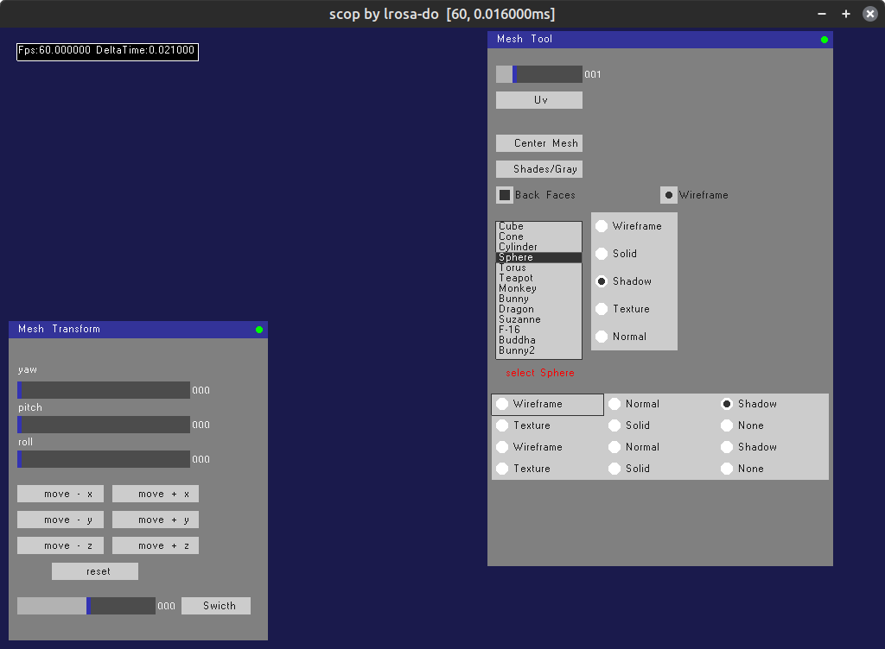
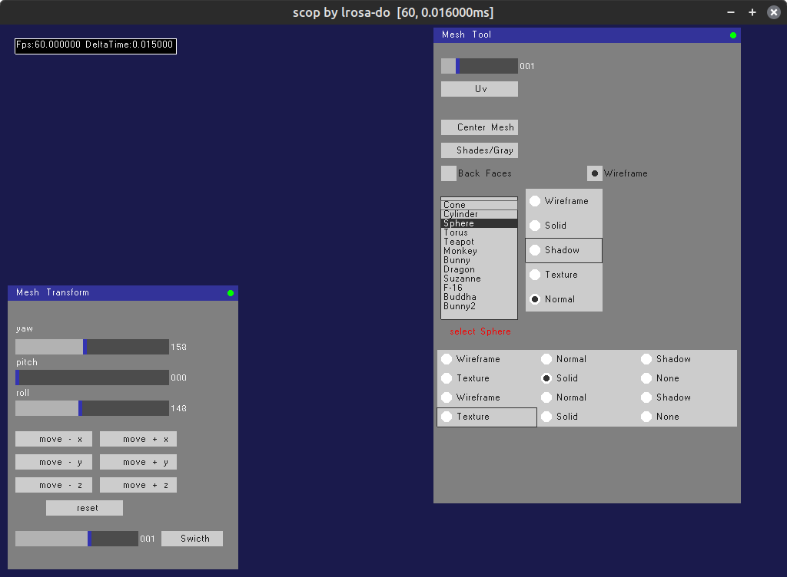

GUI Library for SDL and OpenGL ES 3

This is a C++ GUI library designed for use with SDL and OpenGL ES 3. It provides a set of customizable widgets and elements to facilitate the creation of graphical user interfaces in OpenGL-based applications.
Features

    Widgets: Includes various widgets such as windows, sliders, labels, buttons, checkboxes, radio buttons, radio groups, and list boxes.
    Styling: Customizable skin with color options for different UI elements.
    Integration: Seamlessly integrates with SDL and OpenGL ES 3.
    Input Handling: Supports mouse and keyboard input for interactive UI elements.
    Scalability: Widgets can be easily added, removed, and customized, allowing for flexible UI design.

Initialization: Create an instance of the GUI class and set the desired skin.

cpp

GUI gui;
Skin* customSkin = new Skin();
gui.SetSkin(customSkin);

Widget Creation: Use the provided classes to create various UI elements.

cpp

Window* mainWindow = gui.CreateWindow("Main Window", 100, 100, 800, 600);
Button* mainButton = mainWindow->CreateButton("Click me!", 50, 50, 200, 50);

Event Handling: Implement event handlers for user interactions.

cpp

    mainButton->OnClick =  {
        // Handle button click
    };

# Some screenshots

